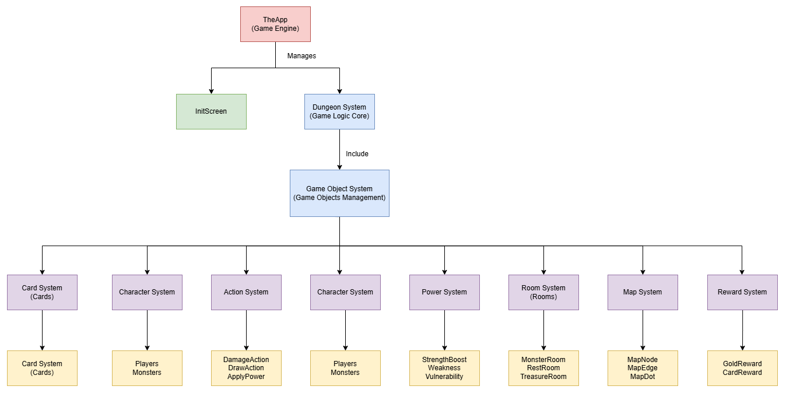
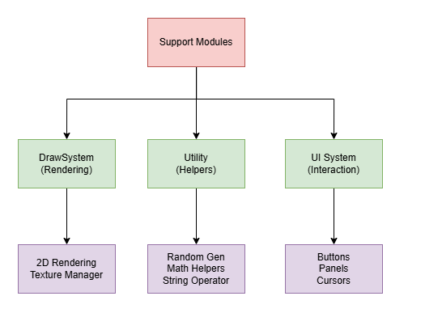

# 2025 OOPL Final Report

## 組別資訊

組別：11 

組員： <br>
資工二 112590059 傅啓碩 <br>
資工二 112590012 陳竑愷 

復刻遊戲： 
Slay the Spire
## 專案簡介

### 遊戲簡介
Slay the Spire 是一款融合了roguelike元素和卡牌構築的回合制遊戲。玩家需要選擇一個角色，從底層開始爬塔，一路上遇到各種敵人、事件和獎勵，最終目標是到達塔頂並擊敗最終Boss。

遊戲的核心是戰鬥系統和卡牌構築。玩家需要通過擊敗敵人獲得卡牌和遺物來增強自己的牌組，同時面對越來越強大的敵人。每場戰鬥中，玩家每回合會抽取5張卡牌，並使用有限的能量點數來打出手牌中的卡牌，進行攻擊、防禦或使用特殊技能。

本次實作的復刻版保留了原遊戲的核心機制，包括多樣化的卡牌系統、隨機生成的地圖、多種敵人類型和戰鬥機制。通過使用C++和OpenGL，我們重現了遊戲的主要功能和視覺效果，提供了與原作相似的遊戲體驗。

### 組別分工

| 組員     | 學號      | 主要負責項目                                    |
|----------|-----------|------------------------------------------------|
 傅啓碩   | 112590059 | OpenGL繪圖；遊戲架構設計；地圖系統；卡牌設計；怪物設計；各房間設計；遊戲特效實踐 |
 | 陳竑愷   | 112590012 | 主畫面設計；角色、怪物設計；卡牌設計；各房間設計；資訊版面設計|


## 遊戲介紹

### 遊戲規則
Slay the Spire的遊戲流程可以簡單概括為：選角色、爬塔、戰鬥、收集卡牌和遺物、強化牌組、擊敗最終Boss。以下是遊戲的具體規則：


**1. 地圖系統**
- 遊戲地圖由多層組成，每層有多個節點連接形成的路徑
- 節點代表不同類型的房間：戰鬥、精英戰鬥、休息點、商店、寶藏
- 玩家可以選擇行進路線，但一旦選擇就無法返回

```cpp
static constexpr auto ROOM_PROBABILITY = RUtil::make_probability_selector(
    std::array{
        std::pair{Room::Room_type::Elite, 0.08F},
        std::pair{Room::Room_type::Event, 0.22F},
        std::pair{Room::Room_type::Rest, 0.12F},
        std::pair{Room::Room_type::Shop, 0.05F},
        std::pair{Room::Room_type::Monster, 0.53F}
    }
);
```

**2. 戰鬥系統**
- 回合制戰鬥，玩家和敵人輪流行動
- 玩家每回合開始時抽取5張卡牌，獲得3點能量
- 卡牌使用需要消耗能量
- 玩家可以使用卡牌進行攻擊、獲得格擋（防禦）或觸發特殊效果
- 未使用的卡牌在回合結束時被棄掉
- 當牌堆用完時，棄牌堆會洗回牌堆

**3. 卡牌系統**
卡牌是遊戲的核心機制，分為以下幾種類型：
- 攻擊卡（Attack）：用於對敵人造成傷害
- 技能卡（Skill）：提供格擋或其他效果
- 能力卡（Power）：提供持續的增益效果
- 狀態卡（Status）：通常是負面效果，會阻礙玩家

```cpp
enum class Type{
    attack,
    skill,
    power,
    status
};
```

卡牌還有不同的稀有度：
- 基礎（Basic）：起始牌組中的卡牌
- 普通（Common）：最容易獲得的卡牌
- 罕見（Uncommon）：較強但較少見的卡牌
- 稀有（Rare）：最強大但最難獲得的卡牌

**4. 狀態效果系統**
遊戲中有多種狀態效果，影響角色的各種屬性：
- 虛弱（Weak）：攻擊傷害減少25%
- 易傷（Vulnerable）：受到的傷害增加50%
- 力量（Strength）：增加攻擊卡的傷害

**5. 商店系統**
在商店中，玩家可以使用金幣購買：
- 卡牌：添加到牌組
- 卡牌移除服務：從牌組中移除一張卡牌

**6. 休息點系統**
在休息點，玩家可以選擇：
- 休息：恢復30%的最大生命值
- 升級：強化一張卡牌，增強其效果

### 遊戲畫面
初始畫面 遊戲主選單，玩家點擊選項以開始遊戲
<br><br>

戰鬥畫面 戰鬥介面，顯示玩家生命值、能量、手牌、敵人等資訊
<br><br>

地圖畫面 尖塔地圖，玩家可以選擇攀爬路徑
<br><br>

商店畫面 商店購物，使用在各關所得的金幣購買卡牌或銷毀牌庫的牌
<br><br>

休息畫面 房間休息，玩家可以選擇升級1張牌 或 休息以恢復30%最大生命
<br><br>


## 程式設計

### 程式架構

本專案採用物件導向設計，分為多個相互關聯的系統。以下是主要的架構組成：

主遊戲架構
<br><br>

輔助系統架構
<br><br>


**1. 核心遊戲系統**
- **TheApp類別**：管理遊戲的主循環和狀態轉換
- **Dungeon_shared類別**：提供共享資源和狀態管理
- **Dungeons類別**：管理整個遊戲的地下城部分

```cpp
class TheApp {
public:
    TheApp();
    ~TheApp()=default;
    void update();
    void render(const std::shared_ptr<Draw::Draw_2D> &r2)const;
private:
    State current_state;
    InitScreen m_InitScreen;
    Dungeon::Dungeon_shared m_dungeon_shared;
    unsigned long long int seed;
    std::shared_ptr<Dungeon::Dungeons> m_dungeon;
    bool fading;
    float fade_a, fade_timer;
};
```

**2. 地圖系統**
- **Map_generator類別**：負責生成隨機地圖
- **Map_node類別**：表示地圖上的節點
- **Map_edge類別**：表示節點之間的連接
- **Dungeon_map類別**：管理地圖的顯示和交互

```cpp
class Map_node {
public:
    Map_node(int x,int y);
    ~Map_node()=default;
    bool HasEdge(Direction dir)const noexcept;
    void add_edge(Direction dir, const std::shared_ptr<Map_edge> &edge)noexcept;
    void SetRoom(const std::shared_ptr<Room::Rooms> &room)noexcept;
    void update(const float screen_offset,const bool is_dungeon_now_room_complete,const bool on_top,Effect::Effect_group &top_effs);
    const int x,y;
};
```

**3. 卡牌系統**
- **Cards類別**：所有卡牌的父類
- **各種卡牌子類**：實現特定卡牌的效果
- **Card_group_handler類別**：管理不同的卡牌組

```cpp
class Cards:public Card_soul, public std::enable_shared_from_this<Cards>{
public:
    Cards(RUtil::AtlasRegionID card_name, RUtil::Cards_Text_ID card_text_id, Rarity rarity, Type type, Color color, Target target,
        const int base_cost, const int base_damage, const int base_block, const int base_magic_num);
    virtual ~Cards() = default;
    
    virtual void Use(Dungeon::Dungeon_shared &dungeon_shared,const std::shared_ptr<Monster::Monsters> &target_monster)=0;
    virtual std::shared_ptr<Cards> Clone()const=0;
    virtual void OnEndOfTurn(Dungeon::Dungeon_shared &dungeon_shared);
    
protected:
    virtual void Upgrade(bool for_preview)=0;
    bool upgraded=false;
    bool exhaust=false;
    bool ethereal=false;
    int base_damage, base_block, base_magic_num, base_cost;
    int damage, block, magic_num, cost;
};
```

**4. 角色系統**
- **Character類別**：所有角色的父類
- **Player類別**：玩家角色
- **Monsters類別**：所有怪物的父類
- **各種怪物子類**：實現特定怪物的行為

```cpp
class Monsters : public Character{
public:
    Monsters(GroupName name,float offset_x, float offset_y);
    virtual ~Monsters()=default;
    
    virtual void update(Dungeon::Dungeon_shared &dungeon_shared);
    virtual void render(const std::shared_ptr<Draw::Draw_2D> &r2)const;
    virtual void damage(const Damage_info& damage_info, Dungeon::Dungeon_shared &dungeon_shared);
    virtual void killed(Dungeon::Dungeon_shared &dungeon_shared);
    
    virtual void Action(Dungeon::Dungeon_shared &dungeon_shared)=0;
    virtual void next_move(Dungeon::Dungeon_shared &dungeon_shared)=0;
};
```

**5. 行動系統**
- **Action_group_handler類別**：管理遊戲中的行動序列
- **各種行動類**：如Damage_action、Apply_power_action等

**6. 房間系統**
- **Rooms類別**：所有房間的父類
- **各種房間子類**：如Monster_room、Shop_room等

**7. 效果系統**
- **Effects類別**：所有視覺效果的父類
- **Effect_group類別**：管理多個效果
- **各種效果子類**：實現特定視覺效果

**8. 狀態效果系統**
- **Power_group類別**：管理角色的狀態效果
- **各種狀態效果類**：實現特定狀態效果

**9. 介面系統**
- **各種畫面類**：如Dungeon_screen、Shop_screen等
- **Top_panel類別**：管理頂部面板


### 程式技術
在開發Slay the Spire的過程中，我們運用了多種程式技術和設計模式，以下是一些主要的技術亮點：

**1. 多層次繼承與多型系統**
我們實現了一個深度的繼承系統，使程式碼高度可重用且可擴展：
- **類別層次結構**：從抽象基類（如`Character`、`Cards`、`Rooms`等）延伸出具體實現
- **虛擬函數與覆寫**：透過`virtual`與`override`確保正確的多型行為
- **抽象介面隔離**：將共用功能提取到基類，讓子類專注於實現特定行為

```cpp
class Cards:public Card_soul, public std::enable_shared_from_this<Cards>{
public:
    Cards(RUtil::AtlasRegionID card_name, RUtil::Cards_Text_ID card_text_id, Rarity rarity, Type type, Color color, Target target,
        const int base_cost, const int base_damage, const int base_block, const int base_magic_num);
    virtual ~Cards() = default;
    
    virtual void Use(Dungeon::Dungeon_shared &dungeon_shared,const std::shared_ptr<Monster::Monsters> &target_monster)=0;
    virtual std::shared_ptr<Cards> Clone()const=0;
    virtual void OnEndOfTurn(Dungeon::Dungeon_shared &dungeon_shared);
    
protected:
    virtual void Upgrade(bool for_preview)=0;
    bool upgraded=false;
    bool exhaust=false;
    bool ethereal=false;
    int base_damage, base_block, base_magic_num, base_cost;
    int damage, block, magic_num, cost;
};
```

**2. 命令模式與行動隊列系統**
我們實現了一個精細的行動隊列系統，用於管理遊戲中的各種行動和效果：
- 命令封裝：將不同的行動（攻擊、加盾、施加狀態）封裝為命令對象
- 隊列執行：按順序處理行動，確保遊戲邏輯的正確性
- 回調機制：行動完成後自動觸發後續行動，形成連鎖效果

```cpp
void Uppercut::Use(Dungeon::Dungeon_shared &dungeon_shared, const std::shared_ptr<Monster::Monsters> &target_monster){
    dungeon_shared.action_group_handler.AddActionBot(
        std::make_shared<Action::Damage_action>
        (
            Damage_info{this->damage, dungeon_shared.player, AttackType::slash_diagonal},
            target_monster
        )
    );
    dungeon_shared.action_group_handler.AddActionBot(std::make_shared<Action::Apply_power_action>(RUtil::Powers_Text_ID::Weakened, this->magic_num, dungeon_shared.player, target_monster));
    dungeon_shared.action_group_handler.AddActionBot(std::make_shared<Action::Apply_power_action>(RUtil::Powers_Text_ID::Vulnerable, this->magic_num, dungeon_shared.player, target_monster));
}
```

**3. 狀態模式與怪物AI系統**
我們為不同的怪物實現了獨特的AI行為系統：
- 行為狀態機：每個怪物維護自己的狀態和行為歷史
- 條件轉換：基於內部狀態和外部環境動態選擇下一步行動
- 行為追蹤：記錄歷史行為，避免重複相同的攻擊模式

```cpp
void SpikeSlimeL::next_move(Dungeon::Dungeon_shared &dungeon_shared){
    auto final_next=SpikeSlimeLAction::FlameTackle;
    switch(static_cast<SpikeSlimeLAction>(dist.NextIndex(dungeon_shared.random_package.monster_ai_rng))){
        case SpikeSlimeLAction::FlameTackle:
            if(is_last_two_move(SpikeSlimeLAction::FlameTackle))
                final_next=SpikeSlimeLAction::Lick;
            break;
        case SpikeSlimeLAction::Lick:
            if(!is_last_two_move(SpikeSlimeLAction::Lick))
                final_next=SpikeSlimeLAction::Lick;
            break;
        default:
            break;
    }

    switch(final_next){
        case SpikeSlimeLAction::FlameTackle:
            set_move(SpikeSlimeLAction::FlameTackle, nullptr, Intent::attack_debuff, FLAME_TACKLE_DAMAGE, dungeon_shared.player->get_powers());
            break;
        case SpikeSlimeLAction::Lick:
            set_move(SpikeSlimeLAction::Lick, nullptr, Intent::debuff, dungeon_shared.player->get_powers());
            break;
        default:
            break;
    }
}
```

**4. 原型模式與卡牌複製系統**
我們使用原型模式實現卡牌的複製和管理：
- 深度複製：透過Clone()方法創建卡牌的完整副本
- 狀態保存：複製時保留卡牌的升級狀態和其他屬性
- 記憶體優化：只在需要時創建新的卡牌實例

```cpp
// 卡牌基類中的Clone接口
virtual std::shared_ptr<Cards> Clone() const = 0;

// 具體卡牌中的實現
std::shared_ptr<Cards> Strike::Clone() const {
    auto card = std::make_shared<Strike>(card_text_id);
    if(this->upgraded) card->CallUpgrade(true);
    return card;
}

// 在Draw_pile_screen中使用Clone功能
void Draw_pile_screen::open(Dungeon::Dungeon_shared &dungeon_shared) {
    for(const auto& card : dungeon_shared.card_group_handler.draw_pile) {
        this->group.emplace_back(card->Clone());
    }
}
```

**5. 智能指針與資源管理**
我們使用現代C++的智能指針技術進行記憶體和資源管理：
- 共享所有權：使用std::shared_ptr管理物件的生命週期
- self-referencing：透過enable_shared_from_this安全地獲取自身的智能指針
- RAII原則：確保資源的自動分配和釋放，避免記憶體洩漏
```cpp
class Dungeon_shared{
public:
    Dungeon_shared():current_node(nullptr),next_node(nullptr),player(std::make_shared<Character::Player>()){}
    ~Dungeon_shared()=default;
    Dungeon_manager manager;
    RUtil::Random_package random_package;
    Effect::Effect_group effs;
    Effect::Effect_group back_effs;
    Effect::Effect_group top_effs;
    std::shared_ptr<Map::Map_node> current_node=nullptr, next_node=nullptr;
    std::shared_ptr<Character::Player> player;
    Monster::Monster_group room_monsters;
    Card::Card_group_handler card_group_handler;
    Action::Action_group_handler action_group_handler;
    General::Generator_group gen_group;
    General::Overlay overlay;
    std::shared_ptr<General::Current_room_reward> current_room_reward;
};
```

**6. 策略模式與可配置隨機系統**
我們實現了一個可控的隨機性系統，確保遊戲的隨機性和重放性：
- 概率選擇器：通過權重配置不同事件的發生概率
- 獨立隨機源：為不同遊戲元素使用專用的隨機生成器
- 種子系統：使用種子生成可重現的隨機序列

```cpp
static constexpr auto ROOM_PROBABILITY = RUtil::make_probability_selector(
    std::array{
        std::pair{Room::Room_type::Elite, 0.08F},
        std::pair{Room::Room_type::Event, 0.22F},
        std::pair{Room::Room_type::Rest, 0.12F},
        std::pair{Room::Room_type::Shop, 0.05F},
        std::pair{Room::Room_type::Monster, 0.53F}
    }
);

static constexpr auto ELITE_PROBABILITY = RUtil::make_probability_selector(
    std::array{
        std::pair{Monster::GroupName::Gremlin_Nob, 1.0F},
        std::pair{Monster::GroupName::Lagavulin, 1.0F},
        std::pair{Monster::GroupName::_3_Sentries, 1.0F}
    }
);
```

**7. 裝飾器模式與狀態效果系統**
我們實現了一個靈活的狀態效果系統，處理角色的各種臨時屬性修改：
- 屬性修飾：狀態效果作為裝飾器修改角色的基本屬性
- 效果堆疊：多個狀態效果可以疊加，影響最終數值計算
- 計算鏈：通過優先順序管理不同效果的應用順序

```cpp
void Cards::CommonRefreshDamage(const Power::Power_group &player_powers){
    float dmg = static_cast<float>(base_damage);
    // 第一階段修飾
    for(const auto&it:player_powers){
        dmg = it->calculate_damage_dealt(dmg);
    }
    // 最終修飾階段
    for(const auto&it:player_powers){
        dmg = it->calculate_final_damage_dealt(dmg);
    }
    this->damage=static_cast<int>(dmg);
    if(this->damage < 0) this->damage = 0;
}
```

**8. 訪問者模式與卡牌效果系統**
我們使用訪問者模式實現卡牌對不同目標的效果處理：
- 接受者與訪問者分離：卡牌效果（訪問者）與接受者（玩家/怪物）分離
- 雙重分發：基於卡牌類型和目標類型選擇正確的行為
- 擴展性：可以輕鬆添加新的卡牌和效果，無需修改現有代碼

```cpp
// 卡牌使用時的訪問者模式實現
void Shockwave::Use(Dungeon::Dungeon_shared &dungeon_shared, const std::shared_ptr<Monster::Monsters> &target_monster){
    // 對所有怪物應用相同的效果
    for(const auto& m : dungeon_shared.room_monsters.monsters){
        // 添加虛弱效果
        dungeon_shared.action_group_handler.AddActionBot(
            std::make_shared<Action::Apply_power_action>(
                RUtil::Powers_Text_ID::Weakened, this->magic_num, 
                dungeon_shared.player, m
            )
        );
        // 添加易傷效果
        dungeon_shared.action_group_handler.AddActionBot(
            std::make_shared<Action::Apply_power_action>(
                RUtil::Powers_Text_ID::Vulnerable, this->magic_num, 
                dungeon_shared.player, m
            )
        );
    }
}
```
**9. 模板方法模式與泛型怪物行為**
我們使用模板方法模式實現通用的怪物行為框架：
- 行為骨架：在基類中定義算法的整體結構
- 行為鉤子：允許子類重寫特定的行為步驟
- 泛型實現：使用模板參數實現類型安全的行為追蹤

```cpp
// 怪物行為追蹤器模板類
template<size_t N, typename ActionEnum>
class Monster_move_tracker : public Monsters {
protected:
    // 模板方法：設置行動意圖
    void set_move(ActionEnum move, const std::shared_ptr<Effect::Intentions> &intention, 
                 Intent intent, const Power::Power_group &target_powers) {
        current_move_index = static_cast<int>(move);
        move_history[move_history_index] = current_move_index;
        move_history_index = (move_history_index + 1) % N;
        this->intent = intent;
        this->intention = intention;
    }
    
    // 檢查最近N次行動是否包含指定行動
    bool is_last_move(ActionEnum action) const {
        return move_history[(move_history_index - 1 + N) % N] == static_cast<int>(action);
    }
    
private:
    std::array<int, N> move_history;
    int move_history_index = 0;
    int current_move_index = -1;
};
```

**10. 觀察者模式與事件通知系統**
我們實現了一個基於觀察者模式的事件系統，實現各模組間的鬆散耦合：
- 事件發布：遊戲狀態變化時發布事件通知
- 事件訂閱：各模組可以訂閱關注的事件類型
- 異步處理：事件可以即時處理或放入隊列延遲處理

```cpp
// 卡牌使用時的訪問者模式實現
// 玩家受到傷害時的事件處理
void Player::damage(const Damage_info& damage_info, Dungeon::Dungeon_shared &dungeon_shared, bool deduct_block){
    // 執行傷害計算
    auto final_damage = calculate_damage(damage_info);
    
    // 發布傷害前事件
    for(const auto& power : this->powers) {
        power->on_before_damaged(final_damage);
    }
    
    // 執行傷害
    this->current_hp -= final_damage;
    
    // 發布傷害後事件
    for(const auto& power : this->powers) {
        power->on_after_damaged(final_damage);
    }
    
    // 檢查生命值並發布相關事件
    if(this->current_hp <= 0) {
        this->on_death(dungeon_shared);
    }
}
```

## 結語

### 問題與解決方法

在開發過程中，我們遇到了幾個重要的挑戰和問題：

**1. 卡牌效果的實現**
- **問題**：遊戲中有大量卡牌，每張卡牌都有獨特的效果，如何設計一個靈活且可擴展的系統來實現這些效果？
- **解決方案**：我們採用了組合模式和行動隊列系統。每張卡牌的效果被分解為基本行動（如造成傷害、獲得格擋等），這些行動按順序添加到行動隊列中執行。這種設計使得我們可以通過組合基本行動來實現複雜的卡牌效果，同時保持代碼的清晰和可維護性。

```cpp
void Body_slam::Use(Dungeon::Dungeon_shared &dungeon_shared, const std::shared_ptr<Monster::Monsters> &target_monster){
    dungeon_shared.action_group_handler.AddActionBot(
        std::make_shared<Action::Damage_action>
        (
            Damage_info{dungeon_shared.player->GetCurrentBlock(), dungeon_shared.player, AttackType::slash_diagonal},
            target_monster
        )
    );
}
```

**2. 地圖生成和平衡**
- **問題**：如何生成隨機但平衡的地圖，確保玩家有多樣化的選擇，但不會過於困難或過於簡單？
- **解決方案**：我們開發了一個基於權重和規則的地圖生成系統。系統根據設定的權重分配不同類型的房間，同時確保每一層都有多條可能的路徑和足夠的關鍵房間（如休息點和商店）。我們還實現了一個可控的隨機性系統，可以通過調整參數來控制地圖的難度和多樣性。

**3. 怪物AI設計**
- **問題**：如何設計既有挑戰性又不過於複雜的怪物AI，使得每種怪物都有獨特的行為模式？
- **解決方案**：我們為每種怪物實現了獨特的AI系統，使用狀態模式和策略模式。怪物的行動有一定的隨機性，但也遵循特定的模式和規則，例如避免連續使用相同的行動。我們還實現了意圖顯示系統，使玩家可以知道怪物下一步的行動，增加了策略性。

```cpp
void AcidSlimeS::next_move(Dungeon::Dungeon_shared &dungeon_shared){
    auto final_next=AcidSlimeSAction::Lick;
    if(!first_move){
        first_move=true;
        if(dungeon_shared.random_package.monster_ai_rng.Nextboolean()) final_next=AcidSlimeSAction::Tackle;
    }else{
        if(is_current_move(AcidSlimeSAction::Lick)) final_next=AcidSlimeSAction::Tackle;
    }

    switch(final_next){
        case AcidSlimeSAction::Lick:
            set_move(AcidSlimeSAction::Lick, nullptr, Intent::debuff, dungeon_shared.player->get_powers());
            break;
        case AcidSlimeSAction::Tackle:
            set_move(AcidSlimeSAction::Tackle, nullptr, Intent::attack, TACKLE_DAMAGE, dungeon_shared.player->get_powers());
            break;
        default:
            break;
    }
}
```

**4. 遊戲狀態管理**
- **問題**：遊戲中有大量的狀態需要管理，如何確保這些狀態的一致性和正確性？
- **解決方案**：我們設計了一個中央資源管理器（Dungeon_shared）來管理遊戲的各種狀態和資源。我們還使用了狀態模式來管理遊戲的不同階段，確保狀態轉換的清晰和一致。此外，我們使用了觀察者模式來響應狀態變化，使得不同系統可以協調工作。

**5. 性能優化**
- **問題**：遊戲中有大量的視覺效果和計算，如何確保遊戲在各種硬件上運行流暢？
- **解決方案**：我們採用了多種優化技術，包括：
  - 對象池：重用常用對象，減少記憶體分配和釋放
  - 延遲加載：只在需要時加載資源
  - 視覺效果優化：使用精靈圖和批量渲染
  - 算法優化：優化關鍵計算過程

**6. 動畫和視覺效果**
- **問題**：如何實現流暢的動畫和視覺效果，使遊戲看起來更加生動和吸引人？
- **解決方案**：我們實現了一個基於時間的動畫系統，使用線性和非線性插值來創建流暢的動畫效果。我們還開發了一個效果系統，可以方便地添加各種視覺效果，如粒子效果、閃光和漸變。

```cpp
void Map_circle_effect::render(const std::shared_ptr<Draw::Draw_2D> &r2)const{
    r2->SetBlendFunc(GL_SRC_ALPHA,GL_ONE_MINUS_SRC_ALPHA);
    r2->SetColor(COLOR,1.0F);
    auto & img=
        (this->duration<1.0F)?IMG5:
        (this->duration<1.05F)?IMG4:
        (this->duration<1.1F)?IMG3:
        (this->duration<1.15F)?IMG2:IMG1;
    r2->draw(img, this->x-96.0F, this->y-96.0F, 192.0F, 192.0F, this->angle, 96.0F, 96.0F, this->scale, this->scale);
}
```

### 自評

| 項次 | 項目                   | 完成 |
|------|------------------------|-------|
| 1    | 完成 Proposal 上訂定之關卡數 |  V  |
| 2    | 製作作弊模式 |  V  |
| 3    | 期末專案繳交連結均設為Public |  V  |
| 4    | 使專案不會產生 Memory Leak 相關的問題 |  V  |
| 5    | 使遊戲執行時不會產生效能問題 |  V  |
| 6    |  確保遊戲不會中途崩潰  |  V  |

### 心得

經過這一次的OOPL，讓我們學習到如何將一個原先為使用Java撰寫的遊戲，改為以C++進行實踐，過程中，我們碰到了不少難題點，如：原作將數張至數十張圖片合成成一張圖片、遊戲物件多而雜，使得我們進度一度落後，在完成底層系統架構後，我們的整體進度開始加快，逐漸追上進度，另外，由於我們在實踐的過程中，也特別注重程式效率，除了讓遊戲不會卡頓外，也讓整體編譯速度提升。雖然製作的過程一波三折，最後還是完成了本次專案，也從中學到不少以前沒注意到的程式編寫方式。

### 貢獻比例

| 編號 |  班級| 學號| 姓名 | 貢獻比例 |
|------|------|-----|-------------|-------|
| 1    | 資工二 |112590059| 傅啓碩 |  60%  |
| 2    | 資工二 |112590012| 陳竑愷 |  40%  |
